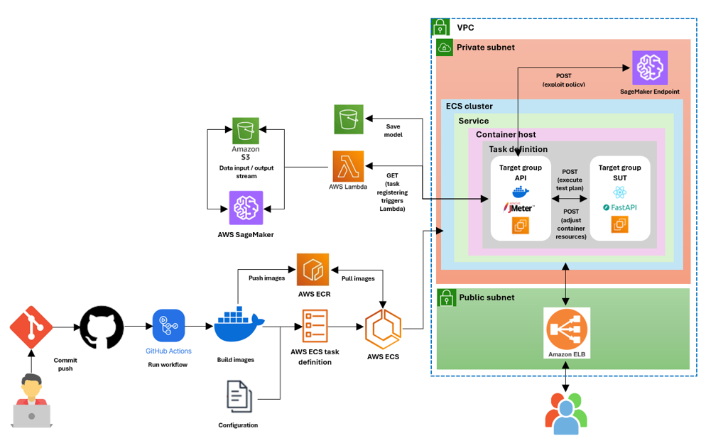

## Reinforcement_Learning_for_Software_Quality_Assurance
This repository provides reinforcement learning-driven frameworks for performance testing. These frameworks facilitate efficient test case generation to meet specific testing objectives without requiring access to the source code or internal models of the system under test (SUT). The approach is powered by four key reinforcement learning models: SaFReL (Q-learning), RELOAD (DQN), A2C (Advantage Actor-Critic), and PPO (Proximal Policy Optimization).

####  Project Context and goals
Traditional software testing lacks adaptability to evolving software behaviors and relies heavily on manual configuration, making it inefficient for modern systems. To address this, we first implemented existing RL-based performance testing agents but found limitations in their performance, adaptability and scalability. These challenges led us to develop our own reinforcement learning-assisted framework, designed to automate performance test generation. Our approach enables efficient testing without requiring access to source code or system models, optimizes resource allocation, and prioritizes critical test scenarios. By leveraging RL, the framework dynamically adapts to system changes, enhancing efficiency and reducing human effort.

####  Solution design
The proposed solution integrates reinforcement learning with cloud-based stress testing to automate and optimize performance evaluation. For more details on the implementation of our agents, navigate to the folders a2c and ppo.

  

####  Key Components
* Version Control & CI/CD: GitHub, GitHub Actions for automated builds and deployment.

* Containerization: Docker images built and pushed to AWS ECR.  

* Orchestration: AWS ECS manages task definitions and service execution.    

* Model Training & Storage:
    * AWS SageMaker trains the PPO model.
    * The trained model is stored in an S3 bucket.
    * AWS Lambda fetches the latest model from S3 and updates the deployed service.

* Stress Testing Environment:
    * ECS cluster hosts containerized applications for testing.
    * JMeter runs performance tests on the System Under Test (SUT).
    * FastAPI serves as an endpoint for predictions.
    * Amazon Application Load Balancer (ALB) routes traffic.

* Networking & Security:
    * The infrastructure operates within a VPC with private and public subnets.
    * The private subnet houses the ECS Cluster and SageMaker Endpoint.
    * The public subnet exposes the ALB to interact with external users.

#### Core Frameworks
* PPO (Proximal Policy Optimization) – The primary model developed in this project and deployed in a cloud environment. It leverages PPO to optimize resource configurations for stress testing.
* A2C (Advantage Actor-Critic) – The secondary model developed in this project, utilizing A2C to optimize resource configurations for stress testing.
* SaFReL (Self-Adaptive Fuzzy Reinforcement Learning) – Designed for platform-based test condition generation using fuzzy reinforcement learning.
* RELOAD (Deep Q-Learning for Load Testing) – Specializes in workload-based test condition generation using adaptive reinforcement learning.

Each framework enables intelligent stress testing by learning optimal resource allocation policies. These policies can be reused in future testing scenarios, offering an adaptable, cost-effective, and scalable solution for continuous performance testing.

####  Deployment Workflow
The entire pipeline automates model training, deployment, and execution using the following steps:

* Code Commit & CI/CD
    * Developers push updates to GitHub.
    * GitHub Actions trigger the CI/CD pipeline.

* Containerization & Image Push
    * Docker images are built and pushed to AWS ECR.

* ECS Deployment
    * AWS ECS fetches the latest container image.
    * ECS task definitions define how the service runs.

* Model Management
    * AWS SageMaker trains the RL models.
    * Trained models are saved to Amazon S3.
    * AWS Lambda retrieves the latest model and updates ECS.

* Performance Testing & Evaluation
    * JMeter generates load on the System Under Test (SUT).
    * FastAPI handles inference and resource optimization.
    * Logs and results are monitored for performance insights.

####  Future Enhancements
* JTransfer Learning for Similarity between SUTs.  
* JDesign and develop a Frontend to connect new systems, and build and deploy test plans.  
* JIntegrate load testing into the framework.
