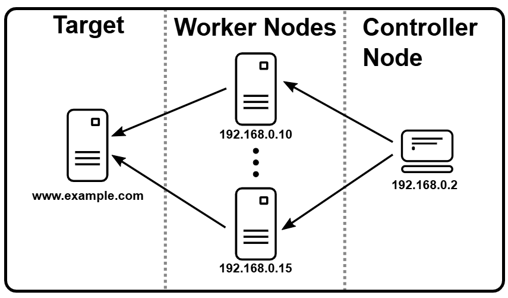
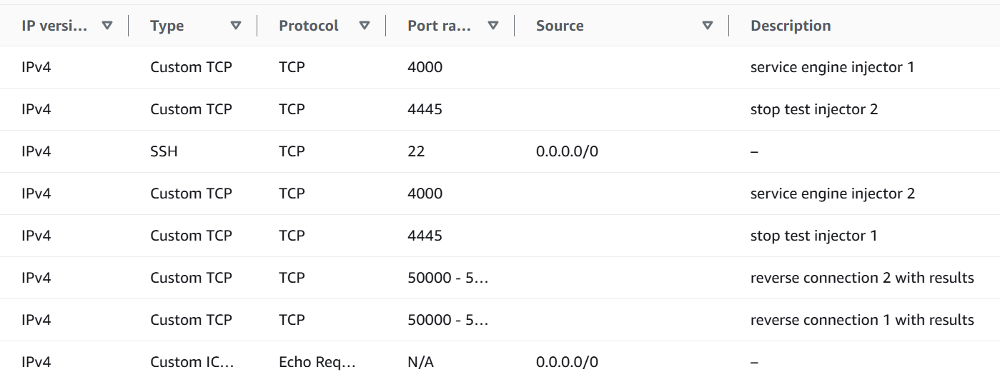

## Reinforcement_Learning_for_Software_Quality_Assurance
This repository contains the source code for a smart reinforcement learning (RL)-assisted performance testing framework. This intelligent testing framework enables efficient generation of performance test cases to meet specific testing objectives without requiring access to the source code or models of the system under test (SUT). It achieves this through two major components: SaFReL and RELOAD.
#### Core Features
* SaFReL: Focuses on platform-based test condition generation using self-adaptive fuzzy reinforcement learning.
* RELOAD: Specializes in workload-based test condition generation using adaptive reinforcement learning.

The framework supports efficient performance testing by learning optimal test case generation policies, which can then be reused in further testing scenarios. It adapts to varying test conditions, offering a cost-effective and intelligent solution for continuous testing activities such as performance regression testing.

### SaFReL: Self-Adaptive Fuzzy Reinforcement Learning
SaFReL is a performance testing agent designed to generate platform-based test cases. It learns 
to optimally tune resource availability (CPU, memory, disk) to 
identify the performance breaking point for various SUTs. The 
framework uses a performance estimation module to predict the 
behavior of software programs based on their sensitivity to 
hardware resources.
<div align="center">
  
</div>

#### Key Features:
- Learns and replays policies to generate platform-based performance 
test cases. 
- Works on CPU-intensive, memory-intensive, and disk-intensive SUTs. 
- Efficiently identifies resource configurations to meet testing objectives. 

#### Versions:
#### Safrel_v1: Theoretical Response Time Estimation
Safrel_v1 estimates the response time of a process using a theoretical model. It calculates the expected performance based on predefined parameters such as system resources, workload intensity, and known performance metrics. By leveraging mathematical formulas or simulation techniques, this version predicts how changes in actions—like adjusting resources—would influence the response time without deploying actual changes. The primary advantage is speed, as it avoids the need for real-world experimentation.
#### Safrel_v2: Dynamic Tuning via Real-World Measurements
Safrel_v2 dynamically applies actions to a running Docker instance hosting the reinforcement learning process. It adjusts the system's resources in real time, such as CPU, memory, or other configurations, to observe the actual impact on the process's response time. By directly measuring the outcomes, this approach provides high fidelity in understanding the real behavior of the system. It is especially useful for environments where theoretical models may fall short in capturing complex, unpredictable dynamics.

#### How it works:
SaFReL tunes hardware configurations to simulate resource-constrained scenarios, 
enabling a thorough evaluation of the SUT's performance. The learned policies can be applied 
to new testing cases, making the framework adaptive and reusable.

#### Reference: 
For detailed insights into SaFReL’s structure and mechanism, refer to the published work:
https://link.springer.com/article/10.1007/s11219-020-09532-z

#### Setting Up the Framework
#### Prerequisites
* Java: Version 17 or higher. 
* Maven: For dependency management and building the project. 
* Hardware Requirements: Ensure sufficient system resources for CPU, memory, and disk-intensive testing scenarios.
* Docker: Version 23.0 or higher.

#### Running SaFReL_v1 or SaFReL_v2

Install IntelliJ IDEA

Clone the repository locally:
```
git clone https://github.com/killianvervelle/Reinforcement_Learning_for_Software_Quality_Assurance
```
Build the project using Maven and install all dependencies:
```
cd Safrel
mvn clean install
```
Optional: open Docker

Run the project JAR file:
```
java -jar <path-to-project-jar>
```

### RELOAD: Adaptive RL-Driven Load Testing
RELOAD is a test agent that efficiently generates and executes 
workload-based performance test cases on the SUT. Using 
reinforcement learning, RELOAD learns the effects of different 
transactions and their optimal load configurations to meet specific 
testing objectives, such as achieving desired response times or error 
rates.
<div align="center">
  
</div>

#### Key Features:
- Generates effective workloads with minimal cost;
- Utilizes Apache JMeter for workload execution;
- Learns and reuses optimal workload generation policies.

#### How it Works:
RELOAD learns to tune the transaction loads in the workload to 
achieve test objectives. This intelligent agent is particularly 
effective for continuous testing scenarios, such as:
- Testing varying performance conditions;
- Performance regression testing; 
- Testing under dynamic workload requirements.

<div align="center">
  
</div>

#### Reference: 
For detailed insights into Reload’s structure and mechanism, refer to the published work:
https://arxiv.org/pdf/2104.12893.

For details on how to implement Distributed Testing, refer to:
https://jmeter.apache.org/usermanual/jmeter_distributed_testing_step_by_step.html

For details on how to build or record a testing plan, refer to:
https://jmeter.apache.org/usermanual/jmeter_proxy_step_by_step.html

For the official implementation of Apache Jmeter, refer to:
https://jmeter.apache.org/

#### Setting Up the Framework
#### Prerequisites
* Java: Version 17 or higher.
* Maven: For dependency management and building the project.
* Apache JMeter: Installed and configured for executing performance tests.
* Hardware Requirements: Ensure sufficient system resources for CPU, memory, and disk-intensive testing scenarios.

#### Running Reload

Set up your cloud environment (here AWS). Launch 3 EC2 instances (1 controller, 2 workers)
- Instance Type: t2.medium
- OS: Ubuntu 22.4 
- Number of vCPUs: 2
- Volume size: 16GB

Set up the security group for your controller. Allow inbound connections on ports 1099, 50000, and 22:
<div align="center">
  
</div>

Set up the security group for your workers. Allow inbound connections on ports 4000, 1099, and 22:
<div align="center">
  
</div>

On each node, install and set up Apache Jmeter and Distributed Testing:
```
wget https://dlcdn.apache.org//jmeter/binaries/apache-jmeter-5.6.3.tgz
tar -xvzf apache-jmeter-5.6.3.tgz
export JMETER_HOME=/path/to/apache-jmeter
export PATH=$JMETER_HOME/bin:$PATH
```
Verify the installation:
```
jmeter -v
```
Design a test plan manually or by using JMeter's Recorder JMeter proxy: [JMeter proxy](https://jmeter.apache.org/usermanual/jmeter_proxy_step_by_step.html).

On the controller node, edit the jmeter.properties file located in the bin directory:
```
cd apache-jmeter-5.6.3/bin
nano jmeter-server.properties
```
- Set remote_hosts=<WORKER2-PRIVATE-IP>,<WORKER2-PRIVATE-IP>
- Set client.rmi.localport=50000  
- Set client.tries=3  
- Set client.retries_delay=1000
- Set server.rmi.ssl.disable=true

On the worker nodes, edit the jmeter.properties file located in the bin directory:
```
cd apache-jmeter-5.6.3/bin
nano jmeter-server.properties
```
- Set server.rmi.localport=4000  
- Set server.rmi.ssl.disable=true

```
# Clone the repository locally
git clone https://github.com/killianvervelle/Reinforcement_Learning_for_Software_Quality_Assurance
```
In the class LoadTester.java, update the following variables. Paths will be different if implementation done locally or in cloud instances.
- JMETER_HOME_PATH = <JMETER_HOME>
- JMETER_PROPERTY_PATH = <JMETER_HOME>/bin/jmeter.properties 
- JMETER_LOG_FILE_PATH = <JMETER_HOME>/bin/transactions_rubis/all_transactions_local_server.jtl 
- JMX_FILES_PATH = <JMETER_HOME>/bin/your-test-plan.jmx

Build the project using Maven and install all dependencies
```
cd Reload
mvn clean install
```

Send the project.jar to your controller node. Use the same key pair assigned at launch of your instance.
```
scp -i <key.pem> <path-to-project-jar> ubuntu@<controller-public-IP>:<JMETER_HOME>/bin/
```


Ensure that all remote nodes have access to the required test plan and dependencies
On each worker node, start the JMeter server.
```
./jmeter-server
```

On the controller node:
If you are using a pre-defined JMX test plan for distributed testing:
```
jmeter -n -t <test-plan-path>.jmx -r
```

For running custom logic with RELOAD:
```
java -jar <path-to-project-jar>
```

### License
Reload, Safrel_v1 and Safrel_v2 are open-source and distributed under:  
```
Copyright (c) 2021, mahshidhelali
Copyright (c) 2024, VervelleKillian
All rights reserved.
```

