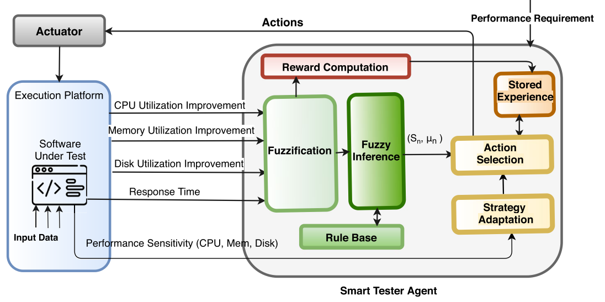

### SaFReL: Self-Adaptive Fuzzy Reinforcement Learning
SaFReL is a performance testing agent designed to generate platform-based test cases. It learns 
to optimally tune resource availability (CPU, memory, disk) to 
identify the performance breaking point for various SUTs. The 
framework uses a performance estimation module to predict the 
behavior of software programs based on their sensitivity to 
hardware resources.
<div align="center">
  
</div>

#### Key Features:
- Learns and replays policies to generate platform-based performance 
test cases. 
- Works on CPU-intensive, memory-intensive, and disk-intensive SUTs. 
- Efficiently identifies resource configurations to meet testing objectives. 

#### Versions:
#### Safrel_v1: Theoretical Response Time Estimation
Safrel_v1 estimates the response time of a process using a theoretical model. It calculates the expected performance based on predefined parameters such as system resources, workload intensity, and known performance metrics. By leveraging mathematical formulas or simulation techniques, this version predicts how changes in actions—like adjusting resources—would influence the response time without deploying actual changes. The primary advantage is speed, as it avoids the need for real-world experimentation.
#### Safrel_v2: Dynamic Tuning via Real-World Measurements
Safrel_v2 dynamically applies actions to a running Docker instance hosting the reinforcement learning process. It adjusts the system's resources in real time, such as CPU, memory, or other configurations, to observe the actual impact on the process's response time. By directly measuring the outcomes, this approach provides high fidelity in understanding the real behavior of the system. It is especially useful for environments where theoretical models may fall short in capturing complex, unpredictable dynamics.

#### How it works:
SaFReL tunes hardware configurations to simulate resource-constrained scenarios, 
enabling a thorough evaluation of the SUT's performance. The learned policies can be applied 
to new testing cases, making the framework adaptive and reusable.

#### Reference: 
For detailed insights into SaFReL’s structure and mechanism, refer to the published work:
https://link.springer.com/article/10.1007/s11219-020-09532-z

#### Setting Up the Framework
#### Prerequisites
* Java: Version 17 or higher. 
* Maven: For dependency management and building the project. 
* Hardware Requirements: Ensure sufficient system resources for CPU, memory, and disk-intensive testing scenarios.
* Docker: Version 23.0 or higher.

#### Running SaFReL_v1 or SaFReL_v2

Install IntelliJ IDEA

Clone the repository locally:
```
git clone https://github.com/killianvervelle/Reinforcement_Learning_for_Software_Quality_Assurance
```
Build the project using Maven and install all dependencies:
```
cd Safrel
mvn clean install
```
Optional: open Docker

Run the project JAR file:
```
java -jar <path-to-project-jar>
```

### License
Reload and Safrel are open-source and distributed under:  
```
Copyright (c) 2021, mahshidhelali
All rights reserved.
```