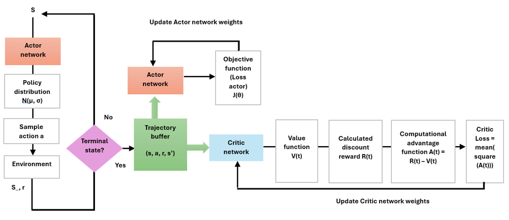
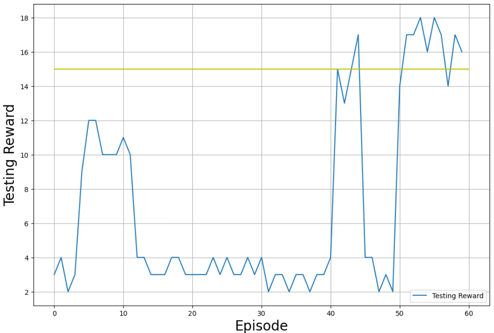
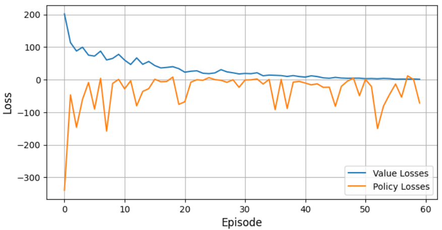

### A2C Framework: Advantage Actor-Critic for Reinforcement Learning
The A2C Framework implements the Advantage Actor-Critic algorithm, a reinforcement learning approach designed to balance exploration and exploitation. The algorithm utilizes two neural networks: an actor to determine actions and a critic to estimate value functions, optimizing the agent's performance in a custom environment. 
<div align="center">
  
</div>

#### Key Features:
- Implements the Advantage Actor-Critic algorithm for reinforcement learning.
- Trains agents in a custom-defined environment with a discrete action space.
- Uses neural networks for policy optimization and value estimations.

#### How it works:
The A2C Framework trains agents to optimize rewards in a reinforcement learning environment. The actor network selects actions based on current states, while the critic network evaluates those actions to guide the actor toward better decisions. 

#### Implementation: 
<div align="center">
  
</div>

#### Setting Up the Framework
#### Prerequisites
* Python: Version 3.10 or higher.
* Dependencies: Install the required libraries.
* Hardware: A GPU is recommended for faster training but is not required.

#### Running the Framework

Clone the repository locally:
```
git clone https://github.com/killianvervelle/Reinforcement_Learning_for_Software_Quality_Assurance
```
Set Up the Environment:
```
python -m venv venv
venv\Scripts\activate
pip install -r requirements.txt
```
Run the A2C Framework:
```
cd Reinforcement_Learning_for_Software_Quality_Assurance/a2c
python src/main.py
```

#### Visualization of Results
Graphs and metrics summarizing the agent's performance can be visualized using TensorBoard or the custom plotting script in the main file.
<div align="center">
  
  
  <br><br>
  
</div>

#### Reference: 
For detailed insights into the A2C algorithm, refer to the foundational research:
https://paperswithcode.com/method/a2c