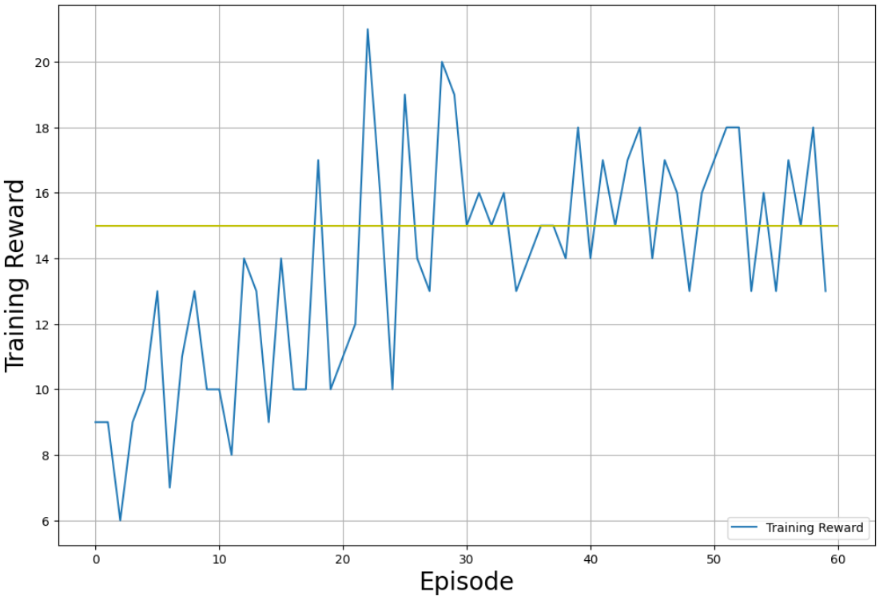
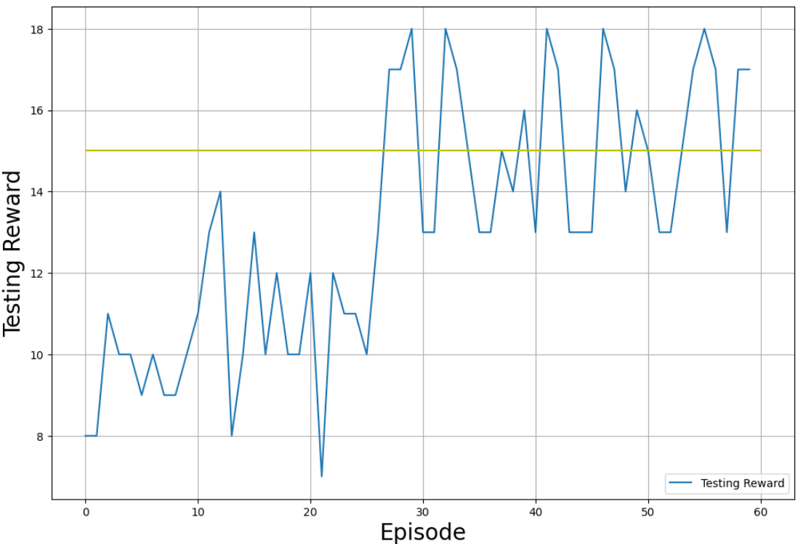

### PPO Framework: Proximal Policy Optimization for Reinforcement Learning
The PPO Framework implements the Proximal Policy Optimization (PPO) algorithm, a state-of-the-art reinforcement learning approach that optimizes policies while maintaining a balance between exploration and exploitation. PPO is a more stable and efficient version of policy gradient methods, which uses clipped objective functions to ensure reliable updates during training. 
<div align="center">
  
</div>

#### Key Features:
- Implements the Proximal Policy Optimization (PPO) algorithm for reinforcement learning.
- Trains agents in a custom-defined environment with continuous or discrete action spaces.
- Uses a policy network for action selection and a value network for estimating value functions.
- Ensures stable training with the clipped objective function, adaptive learning rate and batch processing.

#### How it works:
PPO optimizes the agent's policy using an objective function with a clipping mechanism that ensures updates to the policy do not deviate too far from the previous one. This prevents drastic policy changes and leads to more stable training. The PPO framework trains the agent by:
- Policy Network (Actor): Determines which actions to take based on the current state of the environment.
- Value Network (Critic): Estimates the value of the state to guide the policy optimization.
- Clipped Objective: PPO prevents large updates by clipping the objective function, which ensures the agent does not make overly aggressive policy updates.
- Batch Processing: PPO processes past trajectories in batches, allowing for more efficient learning and better generalization over multiple episodes, improving the stability and convergence of the training process.

#### Reference: 
For detailed insights into the PPO algorithm and its implementation, refer to the foundational research:
https://arxiv.org/abs/1707.06347

#### Setting Up the Framework
#### Prerequisites
* Python: Version 3.10 or higher.
* Dependencies: Install the required libraries.
* Hardware: A GPU is recommended for faster training but is not required.

#### Running the Framework

Clone the repository locally:
```
git clone https://github.com/killianvervelle/Reinforcement_Learning_for_Software_Quality_Assurance
```
Set Up the Environment:
```
cd Reinforcement_Learning_for_Software_Quality_Assurance/ppo
pip install -r requirements.txt
```
Run the PPO Framework:
```
python src/main.py
```

#### Visualization of Results
Graphs and metrics summarizing the agent's performance can be visualized using TensorBoard or the custom plotting script in the main file.
<div align="center">
  
  
  <br><br>
  
</div>